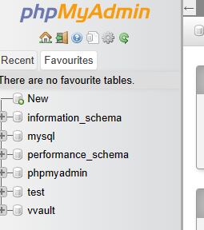

## Follow the instructions to build VVault Server Node API
## Dependencies Install
Make sure to install all dependencies:

1. Node.js please get LTS version at.
https://nodejs.org/en/download/
```bash
# npm
npm install --legacy-peer-deps
npm install -g yarn
```

2. Create Local Database: สร้างฐานข้อมูลบนเครื่องของคุณ หากเครื่องของคุณยังไม่มี โปรแกรม Xampp ให้ดาวโหลดที่ลิงค์ด้านล่างเท่านั้น :
https://www.apachefriends.org/download.html

3. ติดตั้ง Xampp และ Start Apache และ MySQL ดังภาพต่อไปนี้ port ของ MySQL จะรันที่ 3306


## Setup Environment
4. คลิ๊กไปที่ Admin เพื่อเข้าสู่ phpMyAdmin web interface 

5. หลังจากนั้นให้สร้าง Database ใหม่ชื่อ vvault ดังภาพต่อไปนี้ โดยกดที่ลูกศร +New 

6. สร้างไฟล์ .env และนำโค้ดวางลงด้านล่างไปวางใน ไฟล์ .env และ setup DATABASE_URL ให้ตรงกับ MySQL ที่สร้าง หากไม่ต้องการตั้ง username หรือ password ให้ใช้ script ดังต่อไปนี้ หากต้องการตั้ง username และ password อ่านข้อถัดไป
```bash
DATABASE_URL="mysql://root:@localhost:3306/vvault"

JWT_SECRET = "musicsdfsdfsdu834ur5"
```

7. ยังไม่รู้

8. Migrate Data
```bash
npx prisma migrate dev
```

9. Seed Data
```bash
node prisma\seed.js
```

## Starting Development Server

10. Start the development server on `http://localhost:4000`:

```bash
# npm
yarn run dev
```

## Production

Build the application for production:

```bash

```

Locally preview production build:

```bash

```

Check out the [yarn documentation](https://yarnpkg.com/cli) for more information.
